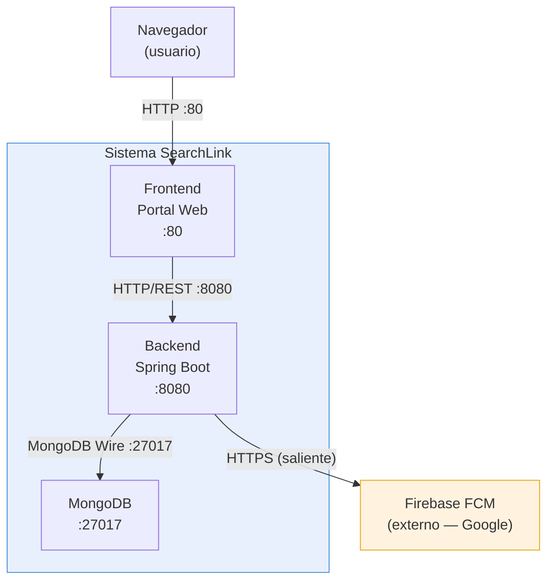

# Architecture — SearchLink

Plataforma de alertas geolocalizadas para la búsqueda de niños desaparecidos.
**TP Integrador — Ingeniería de Datos II · UADE**

---

## Tabla de contenidos

1. [Entorno de ejecución](#entorno-de-ejecución)
2. [Servicios y responsabilidades](#servicios-y-responsabilidades)
3. [Comunicación entre servicios](#comunicación-entre-servicios)
4. [Diagrama de componentes](#diagrama-de-componentes)
5. [Flujo principal de una alerta](#flujo-principal-de-una-alerta)
6. [Gestión del proyecto](#gestión-del-proyecto)

---

## Entorno de ejecución

El sistema puede levantarse de dos formas equivalentes en la máquina del desarrollador:

### Opción A — Instalación local directa

MongoDB y Java instalados en el sistema operativo:

```bash
# Iniciar MongoDB (instalado localmente)
mongod --dbpath ./mongo-data

# Iniciar el backend
cd backend
mvn spring-boot:run
```

### Opción B — Docker como herramienta de desarrollo

Docker se usa como entorno de desarrollo personal para no tener que instalar MongoDB localmente. No es parte de la arquitectura del sistema: es una conveniencia de desarrollo.

```bash
docker compose up --build
```

Compose levanta un contenedor MongoDB y uno Spring Boot conectados en red interna. Los archivos `Dockerfile` y `docker-compose.yml` se versionan en Git para que cualquier colaborador pueda reproducir el entorno con un solo comando.

| Servicio | Puerto (host) |
|---|---|
| MongoDB | 27017 |
| Backend Spring Boot | 8080 |
| Frontend (portal web) | 80 |

---

## Servicios y responsabilidades

### MongoDB

- **Puerto:** 27017
- **Responsabilidad:** Persiste las cuatro colecciones del sistema: `usuarios`, `dispositivos`, `alertas` y `avistamientos`. Mantiene índices `2dsphere` sobre los campos de ubicación para habilitar consultas geoespaciales (`$nearSphere`, `$geoWithin`). El índice TTL sobre `alertas.expira_en` elimina automáticamente las alertas vencidas.
- **Inicialización:** El script `mongo/init/01_init.js` crea las colecciones, aplica los índices y carga un usuario de prueba al arrancar el contenedor por primera vez.

### Backend — Spring Boot (Java)

- **Puerto:** 8080
- **Responsabilidad:** API REST construida con Spring Boot + Spring Data MongoDB. Expone endpoints para crear alertas, registrar usuarios, listar alertas activas y registrar dispositivos FCM. Al publicar una alerta, ejecuta la consulta geoespacial `$nearSphere` sobre la colección `usuarios` para identificar los ciudadanos dentro del radio configurado (default: 10 km) y despacha notificaciones push via **Firebase Cloud Messaging (FCM)**, que es un servicio externo de Google.
- **Paquetes:** `controller/`, `service/`, `repository/`, `model/`, `config/`

### Frontend — Portal Web

- **Puerto:** 80
- **Responsabilidad:** Interfaz web para que operadores carguen alertas con foto, descripción y geolocalización; para que ciudadanos se registren con su ubicación; y para visualizar el mapa de alertas activas. Toda la lógica persiste en el backend; el frontend solo consume la API REST.

---

## Comunicación entre servicios

| Origen | Destino | Protocolo | Dirección |
|---|---|---|---|
| Frontend | Backend | HTTP/REST | `localhost:8080` (o `backend:8080` en Docker) |
| Backend | MongoDB | MongoDB Wire Protocol | `localhost:27017` (o `mongodb:27017` en Docker) |
| Backend | FCM (Google) | HTTPS saliente | `fcm.googleapis.com` |

Dentro de Docker Compose, los servicios se resuelven por nombre de contenedor (`mongodb`, `backend`). En instalación local, se usan URLs con `localhost`.

El frontend nunca se comunica directamente con MongoDB.

---

## Diagrama de componentes



---

## Flujo principal de una alerta

```
Operador carga alerta en el Portal Web
        │
        ▼  POST /api/alertas
Backend recibe datos + coordenadas del navegador (API Geolocation)
        │
        ▼  INSERT en colección alertas
MongoDB almacena el documento (GeoJSON Point + TTL)
        │
        ▼  $nearSphere sobre colección usuarios (radio configurable, default 10 km)
MongoDB devuelve lista de usuarios en el área
        │
        ▼  Batch de tokens FCM desde colección dispositivos
Backend despacha notificación push a cada dispositivo registrado
        │
        ▼
Ciudadano recibe la alerta y puede reportar un avistamiento
```

---

## Gestión del proyecto

| Herramienta | Rol en el proyecto |
|---|---|
| **VSCode** | IDE principal para edición de código Java, properties, scripts JS y documentación. |
| **Git** | Control de versiones. El historial refleja la evolución del modelado, la API y la infraestructura. |
| **Claude Code** | Asistente de desarrollo integrado en VSCode. Apoya el diseño de esquemas, generación de código, revisión de consultas geoespaciales y documentación técnica. |
